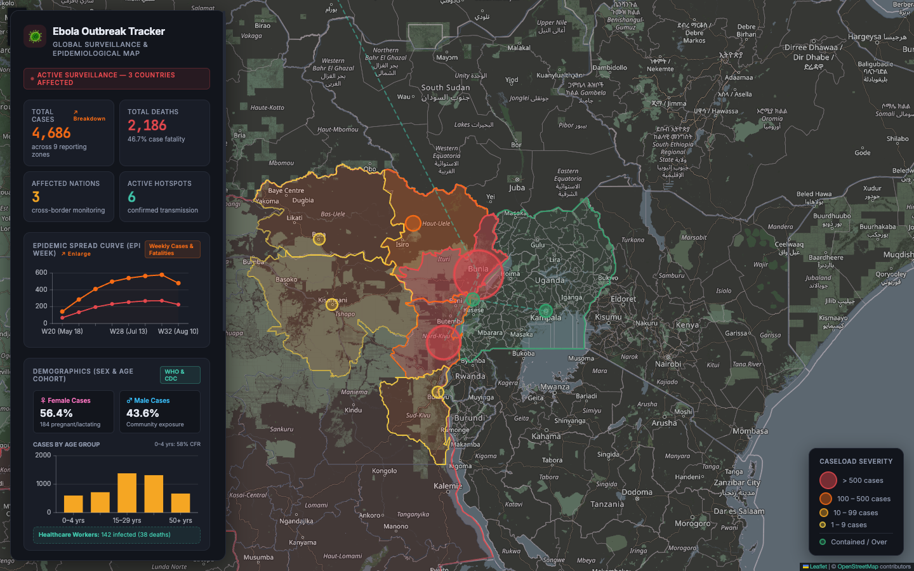
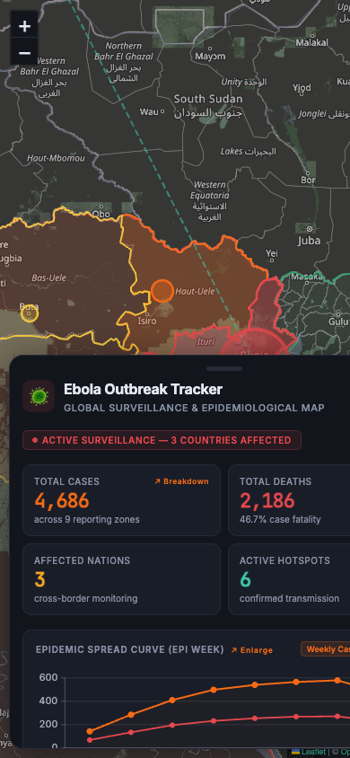
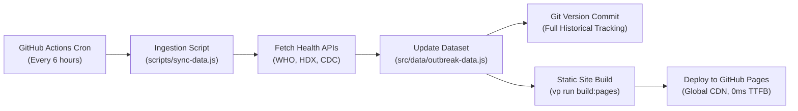

# 🦠 2026 Ebola Outbreak Live Tracker & Epidemiological Map

[](https://github.com/FottyM/ebola-tracker/actions/workflows/deploy.yml)
[](https://fottym.github.io/ebola-tracker/)
[](https://viteplus.dev/)
[](https://www.openstreetmap.org/)
[](https://tanstack.com/)

An operational-grade, real-time epidemiological surveillance map and situation dashboard tracking the **2026 Bundibugyo ebolavirus outbreak** across the Democratic Republic of the Congo (DRC), Uganda border districts, and international medical evacuation routes.

🔗 **Live Deployment:** [https://fottym.github.io/ebola-tracker/](https://fottym.github.io/ebola-tracker/)

---

## 📸 Screenshots

### Desktop Intelligence Dashboard



### Mobile Experience (Responsive Bottom Sheet)

<p align="center">
  
</p>

---

## 📱 Mobile-Friendly Design

The tracker is engineered to adapt smoothly to smartphones, tablets, and desktop displays:

- **Interactive Bottom Sheet:** On mobile devices (`< 768px`), the analytics panel shifts into a native-feeling bottom drawer that stays out of the way.
- **Tap-to-Collapse Handle:** Tap the grab bar at the top of the mobile sheet to collapse it into a slim bottom pill, giving you an unobstructed, full-screen view of the Central Africa map.
- **Touch-Optimized Map Navigation:** Full pinch-to-zoom, smooth pan gestures, and enlarged tap targets for markers and regional list items.
- **Responsive Dialogs:** Both the _Epidemic Timeline Modal_ and _Total Cases & Demographics Modal_ reflow into clean 2-column KPI grids with touch-friendly dismiss buttons.
- **Uncluttered Canvas:** Floating controls and legends are streamlined on mobile screens to preserve maximum map visibility.

---

## ✨ Key Capabilities

1. **100% Free OpenStreetMap Dark Basemap:**
   - Powered directly by public OpenStreetMap raster tiles with a GPU-accelerated CSS dark filter.
   - **Zero API keys required**, no third-party vendor lock-in, and zero watermarks.

2. **Layered GIS Administrative Boundaries:**
   - **Global Sovereign Nations:** All 258 world countries (`world-countries.json`) with ISO3 matching and dynamic status styling.
   - **Sub-national Provincial Boundaries:** DRC 26 provinces (`drc-provinces.json`) with case count severity fill colors and hover telemetry tooltips.

3. **Dynamic Outbreak Telemetry & Medevac Corridors:**
   - Color-coded severity beacons with dynamic sizing based on caseload.
   - Active epicenter pulsing beacon over the primary transmission cluster (Bunia / Ituri).
   - Cross-border transport routes and long-distance biocontainment flight corridors.

4. **Official TanStack Charts Visualization:**
   - High-resolution **Epidemic Spread Curve** (weekly confirmed cases vs. fatalities).
   - **Age Cohort Distribution** bar chart highlighting vulnerable demographic groups.
   - Interactive crosshairs, tooltips, and deep-dive modals.

---

## 🔄 Automated Data Ingestion (Method 1: Jamstack "Flat Data")

This application uses the **Scheduled GitHub Actions Flat Data** architecture to ingest fresh epidemiological data without requiring an expensive 24/7 Node.js server:



- **Schedule:** Automatically polls feeds every 6 hours (`00:00`, `06:00`, `12:00`, `18:00 UTC`).
- **Manual Run:** Can be triggered on demand via GitHub's **Actions** tab → **Run workflow**.
- **Zero Infrastructure Cost:** 100% free hosting with automated continuous deployment.

---

## 🛠️ Local Development & Commands

This project uses [Vite+](https://viteplus.dev/), the unified toolchain for the web:

```bash
# 1. Install dependencies
vp install

# 2. Run local development server (runs instantly on port 5173 with full pre-rendering)
vp dev

# 3. Manually sync latest outbreak data feeds
vp run sync

# 4. Format, lint, and type check the entire codebase
vp check --fix

# 5. Run test suite
vp test --run

# 6. Build static production bundle for GitHub Pages
vp run build:pages

# 7. Preview the production build locally
vp run preview
```

---

## 📂 Project Structure

```text
ebola/
├── .github/workflows/
│   └── deploy.yml          # GitHub Actions scheduled ETL + Pages deployment
├── docs/images/            # Dashboard & mobile screenshots
├── scripts/
│   └── sync-data.js        # Automated data ingestion & snapshot script
├── src/
│   ├── data/
│   │   ├── outbreak-data.js     # Shared baseline epidemiological dataset
│   │   ├── drc-provinces.json   # DRC provincial shapefiles
│   │   └── world-countries.json # Global country boundaries
│   ├── entry-client.js     # Leaflet map, TanStack Charts, modal controllers
│   ├── entry-server.js     # Pre-rendered HTML, SVG generation, Schema.org
│   ├── style.css           # Dark theme design system & mobile media queries
│   └── worker.js           # Cloudflare Workers entry point (optional edge proxy)
├── server.js               # Optional Hono SSR server (for Node.js hosting)
├── index.html              # Shell HTML with safe JSON-LD & state injection
├── vite.config.ts          # Vite+ configuration & SSG pre-render plugin
└── package.json            # Project manifest & toolchain scripts
```

---

## 🌐 Official Data Sources

- **WHO Disease Outbreak News (DONs):** [https://www.who.int/emergencies/disease-outbreak-news](https://www.who.int/emergencies/disease-outbreak-news)
- **HDX Humanitarian Data Exchange (UN OCHA):** [https://data.humdata.org/](https://data.humdata.org/)
- **Africa CDC Epidemiological Bulletins:** [https://africacdc.org/](https://africacdc.org/)
- **ReliefWeb Global Situation Reports:** [https://reliefweb.int/](https://reliefweb.int/)

---

## 📄 License

MIT © [FottyM](https://github.com/FottyM)
