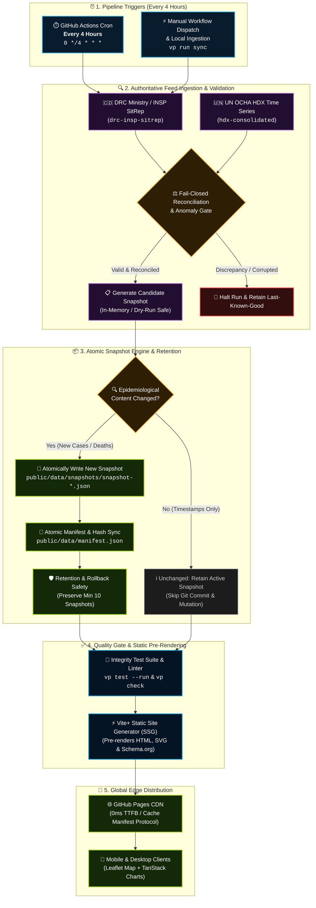

# 🦠 2026 Ebola Outbreak Live Tracker & Epidemiological Map

[](https://github.com/FottyM/ebola-tracker/actions/workflows/deploy.yml)
[](https://fottym.github.io/ebola-tracker/)
[](.github/workflows/deploy.yml)
[](https://viteplus.dev/)
[](https://www.openstreetmap.org/)
[](https://tanstack.com/)
[](LICENSE)

An operational-grade, real-time epidemiological surveillance map and situation dashboard tracking the **2026 Bundibugyo ebolavirus outbreak** across the Democratic Republic of the Congo (DRC), Uganda border districts, and international medical evacuation routes.

🔗 **Live Deployment:** [https://fottym.github.io/ebola-tracker/](https://fottym.github.io/ebola-tracker/)

---

## 📸 Screenshots

### Desktop Intelligence Dashboard


### Mobile Experience (Responsive Bottom Sheet)

<p align="center">
  
</p>

---

## 📱 Mobile-Friendly Design

The tracker is engineered to adapt smoothly to smartphones, tablets, and desktop displays:

- **Interactive Bottom Sheet:** On mobile devices (`< 768px`), the analytics panel shifts into a native-feeling bottom drawer that stays out of the way.
- **Tap-to-Collapse Handle:** Tap the grab bar at the top of the mobile sheet to collapse it into a slim bottom pill, giving you an unobstructed, full-screen view of the Central Africa map.
- **Touch-Optimized Map Navigation:** Full pinch-to-zoom, smooth pan gestures, and enlarged tap targets for markers and regional list items.
- **Responsive Dialogs:** Both the _Epidemic Timeline Modal_ and _Total Cases & Demographics Modal_ reflow into clean 2-column KPI grids with touch-friendly dismiss buttons.
- **Uncluttered Canvas:** Floating controls and legends are streamlined on mobile screens to preserve maximum map visibility.

---

## ✨ Key Capabilities

1. **100% Free OpenStreetMap Dark Basemap:**
   - Powered directly by public OpenStreetMap raster tiles with a GPU-accelerated CSS dark filter.
   - **Zero API keys required**, no third-party vendor lock-in, and zero watermarks.

2. **Layered GIS Administrative Boundaries:**
   - **Global Sovereign Nations:** All 258 world countries (`world-countries.json`) dynamically loaded to eliminate main thread blocking, with ISO3 matching and dynamic status styling.
   - **Sub-national Provincial Boundaries:** DRC 26 provinces (`drc-provinces.json`) code-split and asynchronously loaded, featuring caseload fill styling and hover telemetry.

3. **Dynamic Outbreak Telemetry & Medevac Corridors:**
   - Color-coded severity beacons with dynamic sizing based on caseload.
   - Active epicenter pulsing beacon over the primary transmission cluster (Bunia / Ituri).
   - Cross-border transport routes and long-distance biocontainment flight corridors (quarantining international medical evacuations in France and Germany from national DRC statistics).

4. **Official TanStack Charts Visualization:**
   - High-resolution **Epidemic Spread Curve** (weekly confirmed cases vs. fatalities).
   - **Age Cohort Distribution** bar chart highlighting vulnerable demographic groups.
   - Interactive crosshairs, tooltips, and deep-dive modals.

5. **Truthful Freshness & Provenance Telemetry:**
   - Real-time freshness status pill (**Current**, **Stale**, or **Degraded**).
   - Official Ministry reporting timestamp formatted in European notation (`DD/MM/YYYY HH:mm`).
   - Clean separation of source transport reachability from underlying epidemiological freshness.

---

## 🔄 Automated Data Ingestion & Snapshot Pipeline

The platform uses a scheduled, fail-closed atomic snapshot pipeline running on GitHub Actions. It ingests official health feeds, reconciles hierarchical boundaries, detects genuine epidemiological changes, and redeploys static assets to GitHub Pages:



### Pipeline Guarantees

- **4-Hour Scheduled Cadence:** Automatically executes every 4 hours (`00:00`, `04:00`, `08:00`, `12:00`, `16:00`, `20:00 UTC`).
- **Fail-Closed Reconciliation:** Precedence rules enforce National > Provincial > Health Zone. Mismatched sums trigger a non-destructive pipeline halt, preserving the last-known-good snapshot.
- **Content-Based Change Detection:** Differentiates between volatile check/fetch timestamps and genuine epidemiological changes. Unchanged runs produce zero repository churn and skip git commits.
- **Atomic Snapshots & Manifest Protocol:** Every snapshot is archived under `public/data/snapshots/` and registered with SHA-256 hashing in `public/data/manifest.json`.
- **Snapshot Retention & Instant Rollback:** Retains at least 10 historical snapshots to ensure instant rollbacks via `scripts/rollback-snapshot.js`.

---

## 🛠️ Local Development & Operational Commands

This project uses [Vite+](https://viteplus.dev/), the unified toolchain for the web:

```bash
# 1. Install dependencies
vp install

# 2. Run local development server
vp dev

# 3. Ingestion Dry-Run (Verifies candidate snapshot without mutating disk)
node scripts/sync-data.js --dry-run

# 4. Ingestion Run (Fetches, validates, and persists new snapshot if changed)
vp run sync

# 5. Roll back active deployment to a prior validated snapshot
node scripts/rollback-snapshot.js <snapshotId>

# 6. Verify Ministry remote portal & fixture integrity
node scripts/verify-ministry-live.js

# 7. Format, lint, and type check the entire codebase
vp check --fix

# 8. Run test suite (105+ unit, integration, and operational tests)
vp test --run

# 9. Build static production bundle for GitHub Pages
vp run build:pages

# 10. Preview the static production build locally
vp run preview
```

---

## 📂 Project Structure

```text
ebola/
├── .github/workflows/
│   └── deploy.yml            # GitHub Actions 4-hour scheduled ETL & Pages deployment
├── docs/                     # Architectural tickets, specifications, and runbooks
├── public/
│   ├── data/
│   │   ├── manifest.json     # Current snapshot manifest with SHA-256 hash
│   │   ├── latest-snapshot.json # Active validated outbreak snapshot
│   │   └── snapshots/        # Historical immutable snapshot archive (min 10 retained)
│   └── geography/            # Health zone points and boundary crosswalks
├── scripts/
│   ├── sync-data.js          # Ingestion runner with --dry-run support
│   ├── rollback-snapshot.js  # Atomic rollback tool for prior snapshots
│   └── verify-ministry-live.js # Remote portal probe & fixture hashing
├── server/
│   ├── pipeline/             # Ingestion, validation, and snapshot engine
│   │   ├── contracts.js      # Normalized outbreak schema & validation
│   │   ├── manifest.js       # Manifest generation & atomic disk writer
│   │   ├── pipeline-ingest.js # Change detection & transaction orchestrator
│   │   ├── prerender-loader.js # SSG loader for pre-rendering
│   │   ├── reconciliation.js # Hierarchical boundary & metric reconciliation
│   │   ├── rollback-retention.js # Retention policy & rollback implementation
│   │   ├── snapshot-store.js # Atomic filesystem writes & snapshot archive
│   │   ├── source-health.js  # Source transport health tracking
│   │   ├── sources.js        # Authoritative source registry
│   │   ├── adapters/         # DRC, HDX, and international source adapters
│   │   └── parsers/          # Ministry SitRep text and PDF table parsers
│   └── server.js             # Optional Hono SSR server (for Node.js hosting)
├── src/
│   ├── data/
│   │   ├── outbreak-data.js  # Fallback baseline epidemiological dataset
│   │   ├── drc-provinces.json # Code-split DRC provincial shapefiles
│   │   └── world-countries.json # Code-split global country boundaries
│   ├── entry-client.js       # Leaflet map, TanStack Charts, modal controllers
│   ├── entry-server.js       # Pre-rendered HTML, SVG generation, Schema.org
│   ├── style.css             # Dark theme design system & mobile media queries
│   └── worker.js             # Cloudflare Workers entry point (optional edge proxy)
├── test/                     # Test suite (105+ tests across 17 test suites)
├── index.html                # Shell HTML with safe JSON-LD & state injection
├── vite.config.ts            # Vite+ configuration & SSG pre-render plugin
└── package.json              # Project manifest & toolchain scripts
```

---

## 🌐 Official Data Sources

- **DRC Ministry of Public Health / INSP:** [https://sante.gouv.cd/documents/sitreps](https://sante.gouv.cd/documents/sitreps) (Canonical authority for national and provincial totals)
- **HDX Humanitarian Data Exchange (UN OCHA):** [https://data.humdata.org/](https://data.humdata.org/) (Health-zone incidence feeds)
- **World Health Organization (WHO):** [https://www.who.int/emergencies/disease-outbreak-news](https://www.who.int/emergencies/disease-outbreak-news) (DONs and acute event tracking)
- **Uganda Ministry of Health:** [https://evd-daily.health.go.ug/](https://evd-daily.health.go.ug/) (Border district surveillance)
- **Ministère du Travail, de la Santé et des Solidarités (France) & BMG (Germany):** International medical evacuation verification
- **Africa CDC:** [https://africacdc.org/](https://africacdc.org/) (Epidemic briefs)

---

## 📄 License

Copyright (C) 2026 Fortunat Mutunda.

This project is licensed under the **GNU General Public License v2.0 (GPL-2.0)** - see the [LICENSE](LICENSE) file for details.
